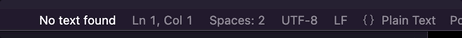
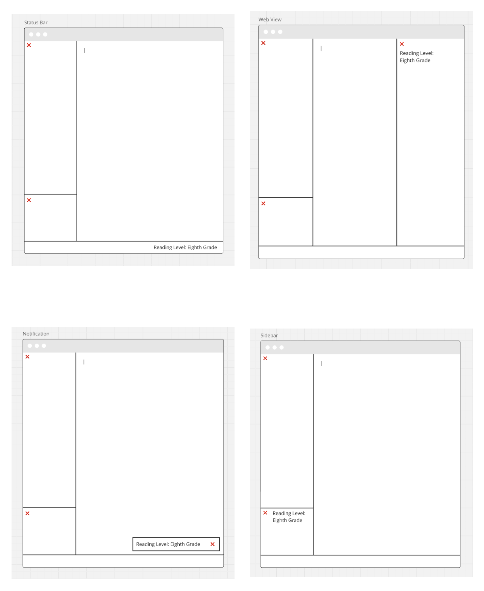
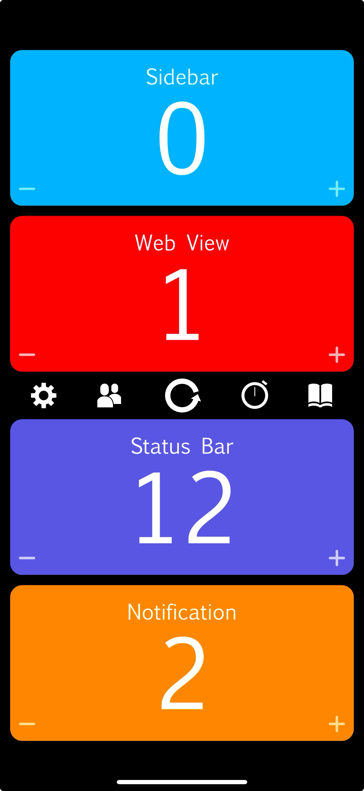

# Reading Rainbow :rainbow:

Reading Rainbow is a VS Code extension that uses the [text-readability package](https://github.com/clearnote01/readability) to provide a reading grade level for the current `*.txt` file. The reading level can be calculated using the Coleman-Liau Index, Dale-Chall Readability Score, Flesch-Kincaid Grade Level, The Fog Scale (Gunning FOG Formula), or the Linsear Write Formula.

When the extension is active, the reading grade level will be displayed in the status bar at the bottom of the window and will update while typing. The grade level will also color coded, from Green for `Kindergarten` to Deep Purple for `PhD` level.

## Development

To validate my ideas about the best way to provide the grade level information, I gathered product feedback by informally polling 15 potential users using wireframes.

Results of the poll were decisive in favor of displaying the information in the status bar.

